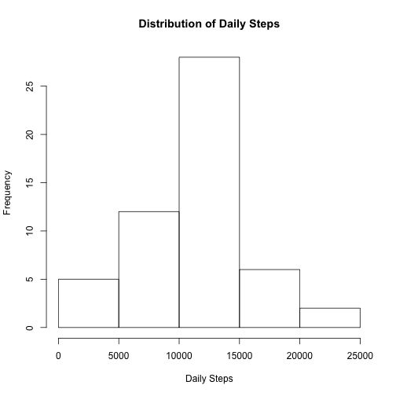
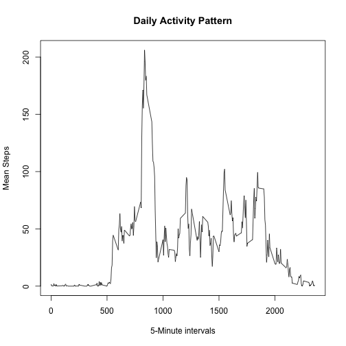
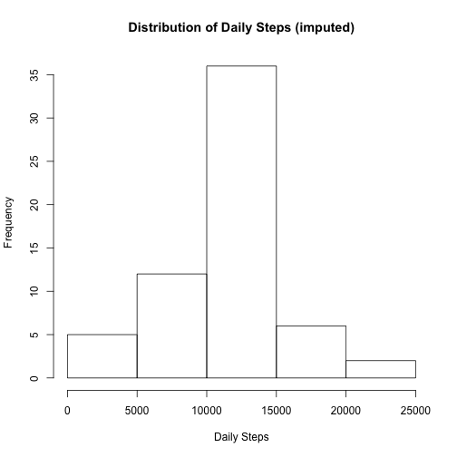
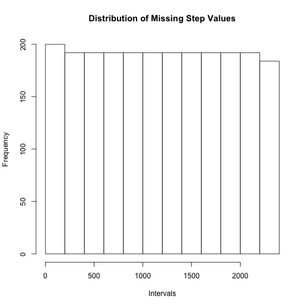
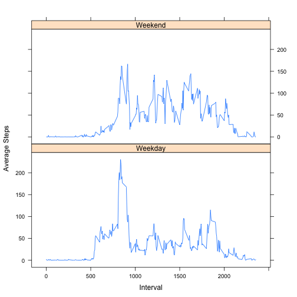

---
title: "Project 1"
output: html_document
---  
# Part 1: Mean Daily Steps 
>Calculate daily steps then show their distribution with a histogram  


```r
# Load the data.table library
if (require(data.table)==FALSE) {install.packages('data.table')}
library(data.table)
```

```r
# Read in the data, converting to table
df = read.csv(file='activity.csv', na.strings='NA')
dt <- data.table(df)
dt.imputed <- data.table(df)

# Create a data.table for daily steps (sum of steps by date)
totalStepsByDay <- dt[, list(Steps=sum(steps)), by=list(date)]

# Plots the daily steps distribution
hist(totalStepsByDay$Steps, main='Distribution of Daily Steps', xlab='Daily Steps')
```

 

>Calculate the mean and median daily steps


```r
# Calculate the mean and median daily steps
results <- data.frame('mean'=numeric(1), 'median'=numeric(1))
results$mean      <- mean (totalStepsByDay$Steps, na.rm=TRUE)
results$median    <- median (totalStepsByDay$Steps, na.rm=TRUE)

# Force R to display all digits, not scientific notation
options(scipen=10)
```
Mean (daily steps) = **10766.1887**  
Median (daily steps) =  **10765**  

# Part 2: Daily Activity Pattern  
>Calculate the mean steps per interval across days; identify maximum mean steps.


```r
# Create a table with mean steps per interval 
dailyActivity <- dt[, list(MeanSteps=mean(na.omit(steps))), by=list(interval)]

# Calculate the maximum mean steps and the interval in which it occurs  
maximumMeanSteps <- max(dailyActivity$MeanSteps)
maxInterval <- dailyActivity[MeanSteps == maximumMeanSteps]

# Plot the mean steps per interval
plot (x=dailyActivity$interval, y=dailyActivity$MeanSteps, type='l', main='Daily Activity Pattern', xlab='5-Minute intervals', ylab='Mean Steps')
```

 

The maximum mean steps occurs at interval **835** with a value of **206.1698**  

# Part 3: Imputing Missing Values
>Calulate the number of missing values  


```r
missingValueRows <- dt[is.na(steps)]
```
Number of observations with missing values is **2304**  
 
  
> Add imputed values and display daily steps distribution


```r
# Mean steps per interval we already have in data.table 'dailyActivity', use those to impute
#
# Update the original data where the steps are NA with the mean steps in 
# in data.table 'dailyActivity', which contains the mean steps by interval.
setkey(dt, interval)
setkey(dailyActivity, interval)
```

```r
dt.imputed[is.na(steps),steps := as.integer(dailyActivity$MeanSteps), nomatch=0]
```

```r
# Recaluculate the total daily steps by date on imputed values and display a histogram
totalStepsByDay.imputed <- dt.imputed[, list(Steps=sum(steps)), by=list(date)]
hist(totalStepsByDay.imputed$Steps, main='Distribution of Daily Steps (imputed)', xlab='Daily Steps')
```

 

```r
# Recalculate the mean and median of total daily steps for imputed values
results.imputed <- data.frame('mean'=numeric(1), 'median'=numeric(1))
results.imputed$mean<- mean (totalStepsByDay.imputed$Steps, na.rm=TRUE)
results.imputed$median<- median (totalStepsByDay.imputed$Steps, na.rm=TRUE)
options(scipen=10)
```

Mean (daily steps, imputed) = **10749.7705**  
Median (daily steps, imputed) =  **10641**  


Net Change (mean daily steps) = **16.4182**  
Net Change (median daily steps) = **124**  

>The imputed values did not change the mean and median total daily steps significantly. However, when looking at the distribution of missing values, below, its not a surprise. Its clear that the missing steps are almost evenly distributed, so adding them would not change the mean and median values significantly.  


```r
hist(missingValueRows$interval, main='Distribution of Missing Step Values', xlab='Intervals')
```

 

# Part 4: Weekday and Weekend Activity  

> Create a new factor in the imputed data distinguishing between weekday and weekend.


```r
# Function to classify a date by type of day - Weekend or Weekday
classifyDay <- function(x){
    x<-weekdays(as.Date(x, "%m/%d/%y"))
    ifelse ( x %in% c('Saturday', 'Sunday'), 'Weekend', 'Weekday')
}
```


```r
# Add the day classification column to the imputed values data.table
dt.imputed[,dayClass:=classifyDay(date)]
```
> Average the steps both by interval and day classification  

> There are visual differences between the weekday and weekend activity patterns; weekday activity has a spike early in the day, whereas weekend activity is more evenly distributed across the time intervals corresponding to 'non-sleeping hours' 


```r
#Average the steps both by interval and day classification, the panel plot he results by day classification
aveStepsByDayClassification <- dt.imputed[, list(aveSteps=ave(na.omit(steps))), by=list(interval, dayClass)]
```

```r
if (require(lattice)==FALSE) {install.packages('lattice')}
require(lattice)
```

```r
xyplot(aveSteps ~ interval | dayClass, 
           data = aveStepsByDayClassification,
           type = "l",
           xlab = "Interval",
           ylab = "Average Steps",
           layout=c(1,2))
```

 
